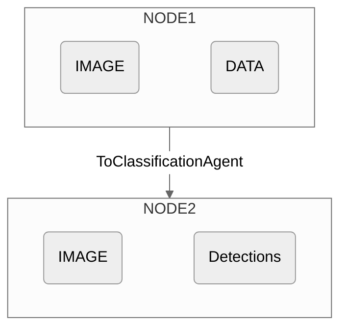

## Initialization
### Parameters

The `ToClassificationAgent` is initialized with 1 argument: 

```
ToClassificationAgent(fn)
```

<ResponseField name="fn" type="Union[Callable[[Any], str], Callable[[Any], List[str]]]" required>
**This function is intended to classify or categorize the input data. It can take in any input type, but should return either a `String` or a `List` of `Strings`**

</ResponseField>

### Example
Here's an example classification function:

```python
def classify_length(text):
    word_count = len(text.split())
    if word_count > 1000:
        return "long"
    elif value > 500:
        return "medium"
    else:
        return "short"
```

```python
ToClassificationAgent(fn=classify_length)
```

## Diagram



{/* 
## Use Cases
The `ToClassificationAgent` is particularly useful in scenarios where data needs to be categorized into predefined classes for further analysis, decision-making, or visualization. Some example use cases include:

> - Image Content Classification
> - Sentiment Analysis
> - Fraud Detection
> - Diagnostics
> - Customer Segmentation */}