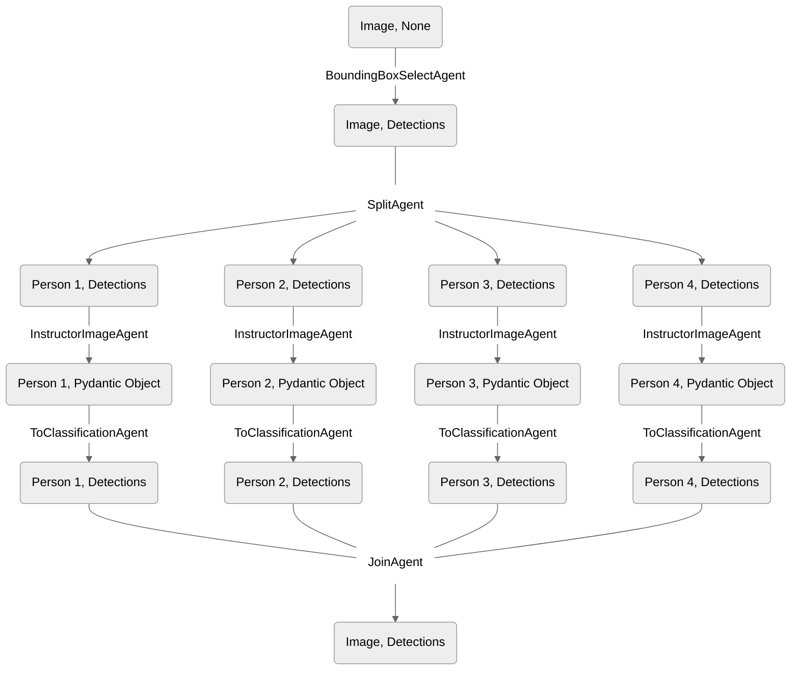

The `SplitAgent` and the `JoinAgent` are both initialized with no arguments: 

```
SplitAgent()
JoinAgent()
```

### Overview

The `SplitAgent` is used in conjunction with the `JoinAgent`. The `SplitAgent` creates multiple crops of an image, and the `JoinAgent` consolidates the results.

Let's take a look at a Workflow:

```python example_1.py
workflow = Workflow([
    BoundingBoxSelectAgent(classes=["person"]),
    SplitAgent(),
    InstructorImageAgent(response_model=PPE),
    ToClassificationAgent(fn=lambda x: "has ppe" if x.hardhat else "no ppe"),
    JoinAgent(),
])
```

Here's a visualization of the above workflow:



### Split Agent

After identifying the bounding boxes around each "person", the `SplitAgent` separates the detected individuals into its own branches so that subsequent processing can be applied to each person detection individually.

<Frame caption="The result after bounding box detection">
  
</Frame>

<Frame caption="Each person is split into its own processing branch">
  
</Frame>

### Join Agent

After each person detection in the image has been individually assessed and classified, the `JoinAgent` reassembles the individual results back into a single output. The `InstructorImageAgent` and `ToClassificationAgent` steps in the workflow act on each person detection individually after the split.

The final merge gathers a comprehensive output that reflects the PPE status of all detected persons in the original image, combining the results into a single image.

<Frame caption="The result of classifying each person detection">
  
</Frame>

<Frame caption="The final joined output">
  
</Frame>