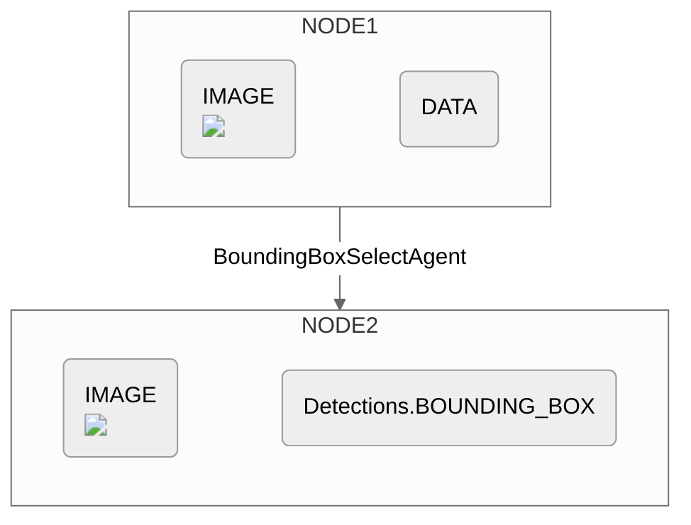

## Initialization

### Parameters

The `BoundingBoxSelectAgent` is initialized with two arguments: 

```
BoundingBoxSelectAgent(classes, model(Optional))
```


<ResponseField name="classes" type="List[String]" required>
**Specifies the list of objects to detect within an image for the object detection task.**

Each object of interest (or "class") should be included within the `classes` list. 
</ResponseField>

<ResponseField name="model" type="BoundingBoxModel">
**Represents the model used to perform the detection task. If left unspecified, this parameter defaults to `GroundingDINO()`.**
  
The supported `BoundingBoxModel` models can be found below:
  <Expandable title="Supported MultimodalLLMs">
    <ResponseField name="GroundingDINO()" type="BoundingBoxModel (Default)">
    </ResponseField>
    <ResponseField name="DETIC()" type="BoundingBoxModel">
    </ResponseField>
    <ResponseField name="OwlV2()" type="BoundingBoxModel">
    </ResponseField>
    <ResponseField name="YOLOWorld()" type="BoundingBoxModel">
    </ResponseField>

  </Expandable>

</ResponseField>

> Note: Since a text embedding of each class will be used to identify objects, a more specific class name will yield a more specific detection. You should scope your class names accordingly. 
> 
> For instance, a `"car"` class will yield more general detections than a `"blue Honda Accord"` class.


## Example

```python example.py
BoundingBoxSelectAgent(classes=["person"])
```

<CardGroup cols={2}>
  <Card
    title="PPE Example"
    icon="circle-info"
    href="https://docs.overeasy.sh/examples/ppe-example"
  >
    See Full Example
  </Card>
</CardGroup>

The output from this agent will be an ExecutionNode containing the previous image and the detection results.

## Diagram



