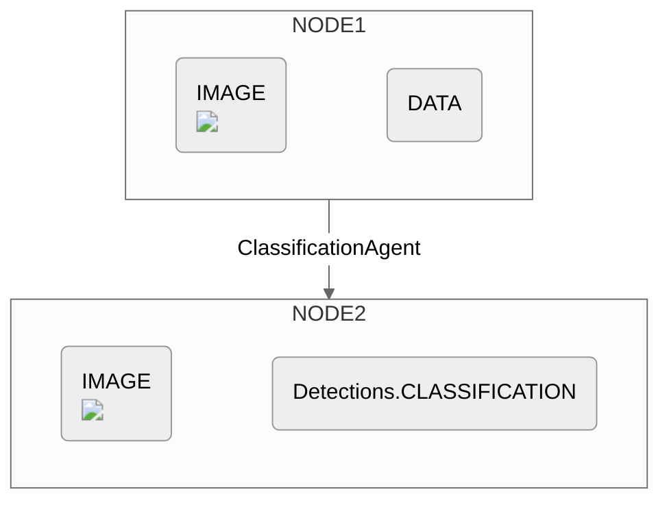

## Initialization

### Parameters

The `ClassificationAgent` is initialized with two arguments: 

```
ClassificationAgent(classes, model(Optional))
```


<ResponseField name="classes" type="List[String]" required>
**Specifies the list of class labels that will be used for the image classification task.**

Each object of interest (or "class") should be described textually within the `classes` list. 

</ResponseField>

<ResponseField name="model" type="ClassificationModel">
**Represents the model used to perform the image segmentation task and takes an instance of `ClassificationModel`. If left unspecified, this parameter defaults to the `CLIP()` Model.**
  
The supported `ClassificationModel` models can be found below:
  <Expandable title="Supported MultimodalLLMs">
    <ResponseField name="CLIP()" type="ClassificationModel (Default)">
    </ResponseField>
    <ResponseField name="OpenCLIPBase()" type="ClassificationModel">
    </ResponseField>

  </Expandable>

</ResponseField>

> Note: Since a text embedding of each class will be used to when classifying the image, a more specific class name will yield a more specific detection. You should scope your class names accordingly. 
> 
> For instance, a `"car"` class will result in more general detections than a `"blue Honda Accord"` class.

## Example

```python example.py
ClassificationAgent(classes=["hard hat", "no hard hat"]), 
```

The output from this agent will be an ExecutionNode containing the previous image and the classification result (i.e. either "hard hat" or "no hard hat").


## Diagram

