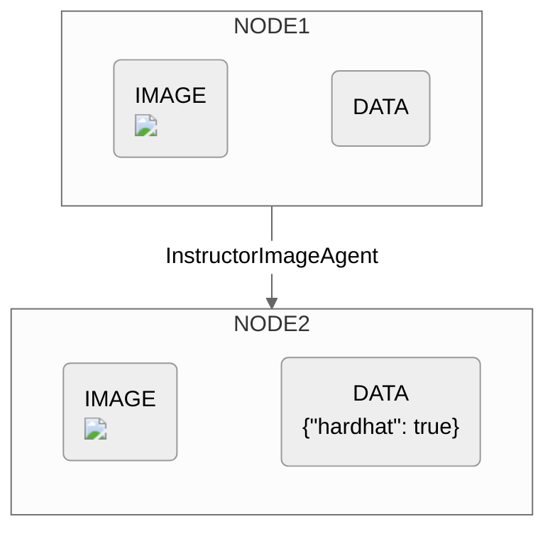

## Initialization

### Parameters

Tge`InstructorImageAgent` is initialized with two arguments: 

```
InstructorImageAgent(response_model, model(Optional))
```

<ResponseField name="response_model" type="BaseModel" required>
**Specifies the structure of the data that the OpenAI API is expected to return. This structured model helps in parsing and validating the data returned from the API, ensuring it adheres to the expected format.**

This parameter expects a class that is a subclass of `BaseModel` from the `pydantic` library. 
</ResponseField>

<ResponseField name="model" type="Optional[String]">
**Specifies the model identifier used by the OpenAI API to process the image. The default value is `"gpt-4o"`.**

You can find a comprehensive list of all OpenAI API models [here](https://platform.openai.com/docs/models).
</ResponseField>

## Example
Here is an example of the `InstructorImageAgent` designed for a Workflow to detect if workers are wearing personal protective equipment (PPE).

**Step 1. Define a `response_model`.**

```python example.py
class PPE(BaseModel):
    hardhat: bool
```

The PPE class has a single attribute `hardhat` that is a boolean, indicating whether a hardhat is present or not.

**Step 2. Use `InstructorImageAgent`.**

```python example.py
InstructorImageAgent(response_model=PPE)
```

The InstructorImageAgent processes images and extracts structured data based on the PPE model. The output from this agent will be an ExecutionNode containing the original image and a Pydantic object that may look like

```python
{
  "hardhat": true
}
```

## Diagram

