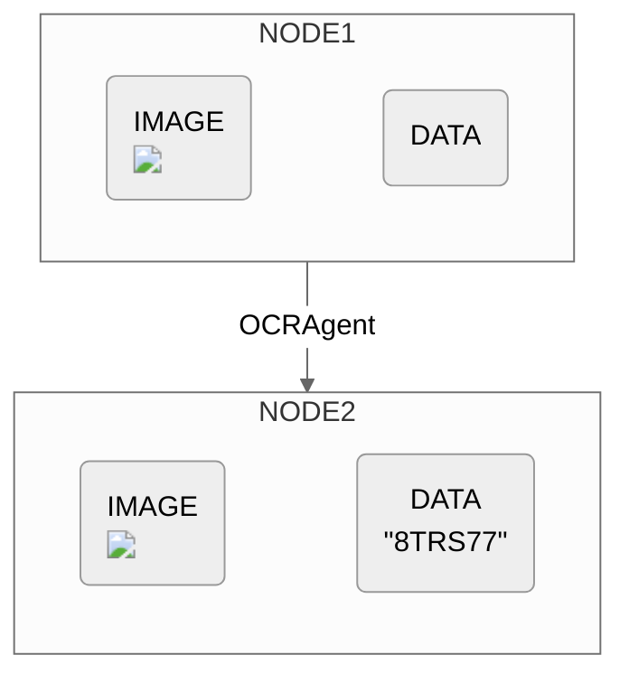

## Properties
### Parameters

The `OCRAgent` accepts 1 optional argument: 

```
OCRAgent(model(Optional))
```

<ResponseField name="model" type="OCRModel" required>
  **The selected model.** All supported `OCRModel` models can be found below: 
  <Expandable title="Supported MultimodalLLMs">
    <ResponseField name="GPT4Vision()" type="OCRModel (Default)">
      Supports `gpt-4-turbo` , `gpt-4o` .
    </ResponseField>
    <ResponseField name="TextractModel()" type="OCRModel">
    </ResponseField>
    <ResponseField name="Claude()" type="OCRModel">
      Supports `claude-3-opus-20240229` , `claude-3-haiku-20240307` , `claude-3-sonnet-20240229` .
    </ResponseField>
    <ResponseField name="Gemini()" type="OCRModel">
      Supports `gemini-pro-vision` .
    </ResponseField>

  </Expandable>
</ResponseField>

### Example
Say we're interested in extracting the license plate from this image:
{/* <Frame>

</Frame> */}


```python example.py
OCRAgent(model=TextractModel())
```

## Diagram



{/* ## Use Cases
The `OCRAgent` is designed to handle use cases where extracting text from images is crucial:

> - Document Digitization
> - Automated Data Entry
> - Translation
> - Text-to-Speech
> - License Plate Recognition */}