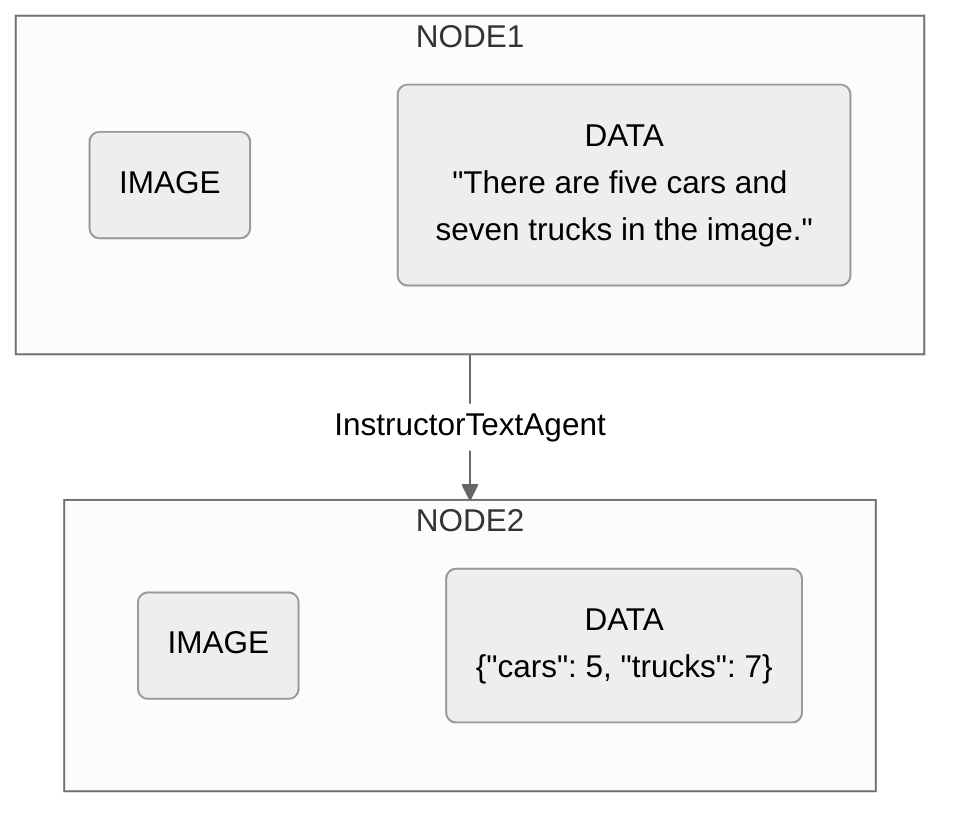

## Initialization

### Parameters

The `InstructorTextAgent` is initialized with two arguments: 

```
InstructorTextAgent(response_model, model(Optional))
```

<ResponseField name="response_model" type="BaseModel" required>
**Specifies the structure of the data that the OpenAI API is expected to return. This structured model helps in parsing and validating the data returned from the API, ensuring it adheres to the expected format.**

This parameter expects a class that is a subclass of `BaseModel` from the `pydantic` library. 
</ResponseField>

<ResponseField name="model" type="Optional[String]">
**Specifies the model identifier used by the OpenAI API to process the image. The default value is `"gpt-4o"`.**

You can find a comprehensive list of all OpenAI API models [here](https://platform.openai.com/docs/models).
</ResponseField>

## Execution

### Parameters
The `Workflow` is expected to have some sort of text input that needs to be processed.

### Example

Here is an example of the `InstructorTextAgent` as part of a `Workflow` for counting vehicles.

**Step 1. Define a `response_model`.**

```python example.py
from pydantic import BaseModel

class TrafficAnalysisResponse(BaseModel):
    cars: int
    trucks: int
```

This model expects the analysis to return the counts of different types of vehicles and a timestamp indicating the time of the image capture.

**Step 2. Use `InstructorTextAgent`.**

```python example.py
InstructorTextAgent(response_model=TrafficAnalysisResponse)
```

## Diagram

