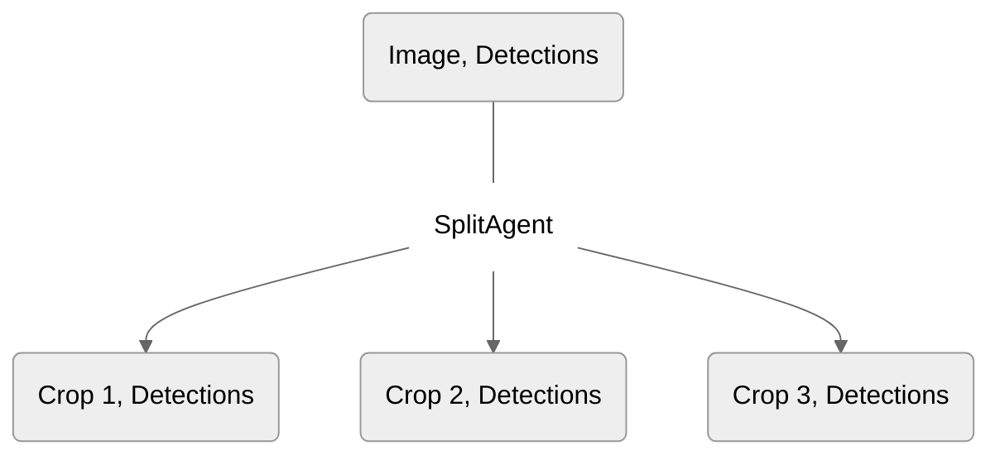

## Overview

There are 4 main classes of Agents in Overeasy: 
- Image Agents
- Text Agents
- Detection Agents
- Join/Split Agents

### **Image Agents**

Image Agents operate on a single PIL image input.
 ```mermaid
%%{init: {'theme': 'neutral' } }%%
flowchart LR
    direction TB
        subgraph NODE1
            direction LR
            I1(Image) ~~~ D1(Data)
        end
        subgraph NODE2
            direction LR
            I2(Image) ~~~ D2(Data)
        end
        NODE1 --ImageAgent--> NODE2
    
    style I1 fill:#ECECFD
```

### **Text Agents** 
Text Agents operate on a single text input.

 ```mermaid
%%{init: {'theme': 'neutral' } }%%
flowchart LR
    direction TB
        subgraph NODE1
            direction LR
            I1(Image) ~~~ D1(Text)
        end
        subgraph NODE2
            direction LR
            I2(Image) ~~~ D2(Data)
        end
        NODE1 --TextAgent--> NODE2
    
    style D1 fill:#ECECFD
```

### **Detection Agents** 
Detection Agents operate on a single [Detections](https://docs.overeasy.sh/types/about-detections) input.

  ```mermaid
%%{init: {'theme': 'neutral' } }%%
flowchart LR
    direction TB
        subgraph NODE1
            direction LR
            I1(Image) ~~~ D1(Detections)
        end
        subgraph NODE2
            direction LR
            I2(Image) ~~~ D2(Data)
        end
        NODE1 --DetectionAgent--> NODE2
    
    style D1 fill:#ECECFD
```

 ### **Split Agent** 
 Split Agents split a Bounding Box Detection into multiple child Nodes/Detections.


 
 ### **Join Agent** 
 Join Agents join multiple Detections into a single Detection.

 ```mermaid
%%{init: {'theme': 'neutral' } }%%
flowchart TD
  1(Crop 1, Detections) & 2(Crop 2, Detections) & 3(Crop 3, Detections) --- JoinAgent(JoinAgent) --> 4(Image, Detections)

  style JoinAgent fill:#ffffff,stroke:#333,stroke-width:0px
```
