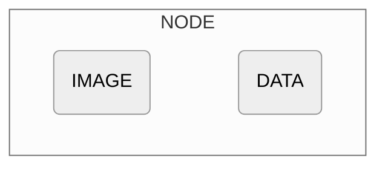
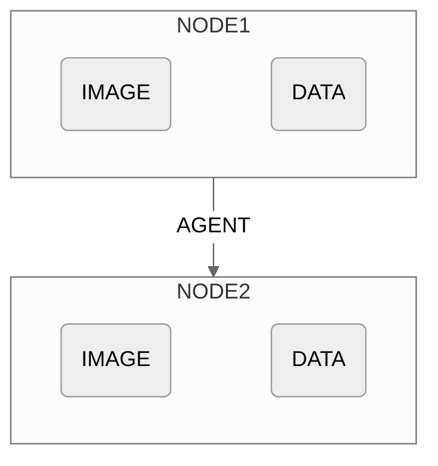
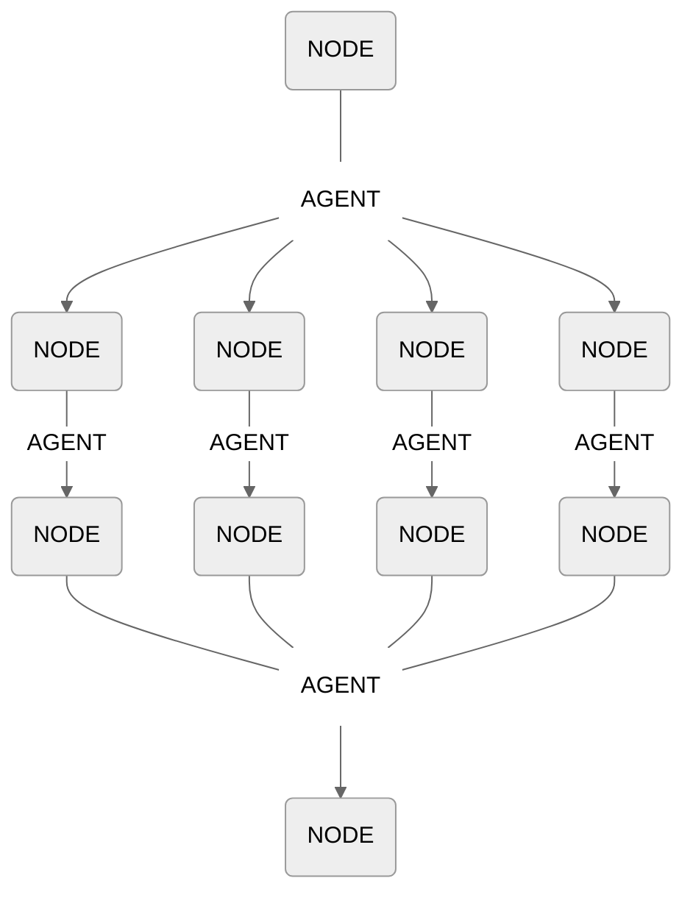

import Underline from '/snippets/underline.mdx';
import UnderlineMargin from '/snippets/underline-margin.mdx';

## Overview

The utilization of the `ExecutionGraph` is handled by Overeasy under the hood and is exposed to help with debugging and visualization.
{/* 
### Execution Node
An `ExecutionNode` can be represented as follows:



where `DATA` can either be text, a Detection object, or a Pydantic object. 

You can find more details on Execution Nodes [here]().

## Execution Graph */}
An Execution Graph tracks the relationships between different [Execution Node](/types/execution-node) instances, representing the entire workflow's execution. Let's take a look at one step in a workflow: 



Upon execution of the agent, Node 2 is added to the Execution Graph, which contains its own image and data attributes.

A workflow is comprised of a series of agents that are executed in order. An Execution Graph takes the form of a Directed Acyclic Graph (DAG), where each layer of the graph represents the outcome of a step in the workflow. Here's an example:


{/* 
## Attributes

<ParamField path="root" type="ExecutionNode" required="true">
  The input image at this step of the workflow.
</ParamField>

<ParamField path="edges" type="Dict[int, List[ExecutionNode]]" required="true">
  The input image at this step of the workflow.
</ParamField>

<ParamField path="parent" type="Dict[int, List[ExecutionNode]]" required="true">
  The input image at this step of the workflow.
</ParamField> */}

## Methods

<ParamField path="ExecutionGraph.ascii_graph()">
   Prints a text-based representation of the graph.
{/* 
  <Card>
   An example output could look like:
   ```
   ExecutionGraph
    └── Node(ID=0)
        └── Node(ID=1)
            ├── Node(ID=2)
            │   └── Node(ID=3)
            │       └── Node(ID=4)
            │           └── Node(ID=5)
            ├── Node(ID=6)
            │   └── Node(ID=7)
            │       └── Node(ID=8)
            │           └── Node(ID=5)
            ├── Node(ID=9)
            │   └── Node(ID=10)
            │       └── Node(ID=11)
            │           └── Node(ID=5)
            └── Node(ID=12)
                └── Node(ID=13)
                    └── Node(ID=14)
                        └── Node(ID=5)
  ```

  An analysis:

  -- **Node(ID=0)**: This is the root node from which all operations begin.

  -- **Node(ID=1)**: This node is directly connected to the root node and acts as a branching point for multiple parallel paths.

  -- **Node(ID=2), Node(ID=6), Node(ID=9), Node(ID=12)**: These nodes are the starting points of separate branches that start from Node(ID=1). Each branch processes data independently.

  -- **Node(ID=3, 7, 10, 13) and Node(ID=4, 8, 11, 14)**: These nodes represent subsequent steps in each respective branch, processing data sequentially within their branch.

  -- **Node(ID=5)**: This node is a convergence point where all branches merge.

  </Card> */}
</ParamField>

<ParamField path="ExecutionGraph.top_sort()">
   
  **Returns:**
  - `List[List[ExecutionNode]]`: Performs a topological sort of the graph, returning a list of list of nodes representing each level of the graph.

  {/* <Card title="Returns">
    <ResponseField name="sorted_nodes" type="List[List[ExecutionNode]]">
      A list of lists of nodes representing each level of the graph.
    </ResponseField>
  </Card> */}
</ParamField>

