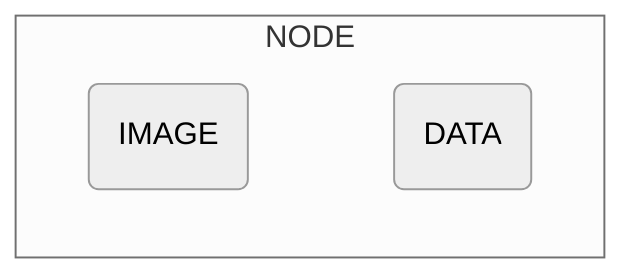

## Overview

The `ExecutionNode` class represents a single step in an image processing workflow. You can think of an Execution Node as containing two main attributes: `IMAGE` and `DATA`. 

All Execution Nodes have a unique `id`.

## Attributes

<ParamField path="image" type="PIL.Image.Image" required="true">
  The input image at this step of the workflow.
</ParamField>
<ParamField path="data" type="any" required="true">
  The data resulting from processing the image.  This could be text, a Detections object, or a Pydantic object.
</ParamField>
<ParamField path="parent_detection" type="Detection" optional="true">
  The detections from the previous step that led to this node.

  Note: This attribute operates behind the scenes to assist with splits and joins.
</ParamField>
<ParamField path="id" type="int">
  The unique identifier of the node.
</ParamField>

## Methods

{/* 
<AccordionGroup>
  <Accordion title="Visualizing Text Data">
    
  </Accordion>

  <Accordion title="Visualizing Detections Data">
    
  </Accordion>

  <Accordion title="Visualizing Pydantic Data">
    
  </Accordion>
</AccordionGroup> */}

<ParamField path="ExecutionNode.visualize()">
  **Returns:**
  - `[PIL.Image.Image]`: Generates a visual representation of the node. If the data in the node are Detections, it annotates the image with the detections. 
Otherwise, it displays the data as text on the image.

  {/* <Card title="Returns">
    <ResponseField name="visualized_image" type="[PIL.Image.Image]">
      The image with annotations or data visualization.
    </ResponseField>
  </Card> */}
</ParamField>
